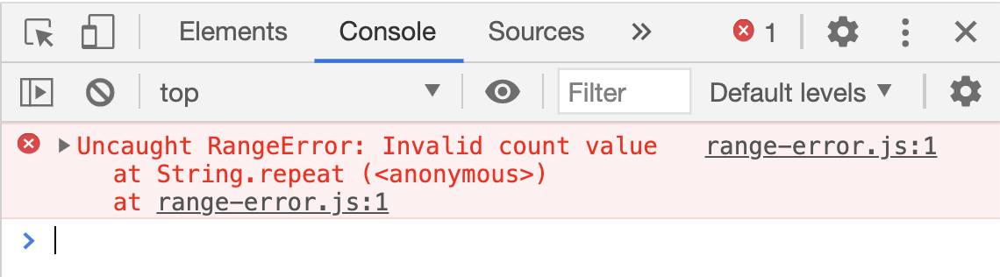

# Debugging Errors

This lab is to help you with reading errors. Remember, debugging is a part of the job as a software engineers; therefore, knowing how to read errors will help speed up the debugging process. 

According to { [MDN Web Docs](https://developer.mozilla.org/en-US/docs/Web/JavaScript/Reference/Global_Objects/Error) }, `Error` objects are thrown when runtime errors occur. The Error object can also be used as a base object for user-defined exceptions.

Here are the list of errors you may encounter using JavaScript:

## 1. { [RangeError](https://developer.mozilla.org/en-US/docs/Web/JavaScript/Reference/Global_Objects/RangeError) }

- List of `RangeError` 
    - [ ] [RangeError: argument is not a valid code point](https://developer.mozilla.org/en-US/docs/Web/JavaScript/Reference/Errors/Not_a_codepoint)
    - [ ] [RangeError: invalid array length](https://developer.mozilla.org/en-US/docs/Web/JavaScript/Reference/Errors/Invalid_array_length)
    - [ ] [RangeError: invalid date](https://developer.mozilla.org/en-US/docs/Web/JavaScript/Reference/Errors/Invalid_date)
    - [ ] [RangeError: precision is out of range](https://developer.mozilla.org/en-US/docs/Web/JavaScript/Reference/Errors/Precision_range)
    - [ ] [RangeError: radix must be an integer](https://developer.mozilla.org/en-US/docs/Web/JavaScript/Reference/Errors/Bad_radix)
    - [ ] [RangeError: repeat count must be less than infinity](https://developer.mozilla.org/en-US/docs/Web/JavaScript/Reference/Errors/Resulting_string_too_large)
    - [ ] [RangeError: repeat count must be non-negative](https://developer.mozilla.org/en-US/docs/Web/JavaScript/Reference/Errors/Negative_repetition_count)

## 2. { [ReferenceError](https://developer.mozilla.org/en-US/docs/Web/JavaScript/Reference/Global_Objects/ReferenceError) }

- List of `ReferenceError`
    - [ ] [ReferenceError: "x" is not defined](https://developer.mozilla.org/en-US/docs/Web/JavaScript/Reference/Errors/Not_defined)
    - [ ] [ReferenceError: assignment to undeclared variable "x"](https://developer.mozilla.org/en-US/docs/Web/JavaScript/Reference/Errors/Undeclared_var) 
    - [ ] [ReferenceError: can't access lexical declaration`X' before initialization](https://developer.mozilla.org/en-US/docs/Web/JavaScript/Reference/Errors/Cant_access_lexical_declaration_before_init)
    - [ ] [ReferenceError: deprecated caller or arguments usage](https://developer.mozilla.org/en-US/docs/Web/JavaScript/Reference/Errors/Deprecated_caller_or_arguments_usage) 
    - [ ] [ReferenceError: invalid assignment left-hand side](https://developer.mozilla.org/en-US/docs/Web/JavaScript/Reference/Errors/Invalid_assignment_left-hand_side)
    - [ ] [ReferenceError: reference to undefined property "x"](https://developer.mozilla.org/en-US/docs/Web/JavaScript/Reference/Errors/Undefined_prop)

## 3. { [SyntaxError](https://developer.mozilla.org/en-US/docs/Web/JavaScript/Reference/Global_Objects/SyntaxError) }
- List of `SyntaxError`
    - [ ] [SyntaxError: JSON.parse: bad parsing](https://developer.mozilla.org/en-US/docs/Web/JavaScript/Reference/Errors/JSON_bad_parse)
    - [ ] [SyntaxError: for-in loop head declarations may not have initializers](https://developer.mozilla.org/en-US/docs/Web/JavaScript/Reference/Errors/Invalid_for-in_initializer)
    - [ ] [SyntaxError: missing ) after argument list](https://developer.mozilla.org/en-US/docs/Web/JavaScript/Reference/Errors/Missing_parenthesis_after_argument_list)
    - [ ] [SyntaxError: missing ) after condition](https://developer.mozilla.org/en-US/docs/Web/JavaScript/Reference/Errors/Missing_parenthesis_after_condition)
    - [ ] [SyntaxError: missing : after property id](https://developer.mozilla.org/en-US/docs/Web/JavaScript/Reference/Errors/Missing_colon_after_property_id)
    - [ ] [SyntaxError: missing ; before statement](https://developer.mozilla.org/en-US/docs/Web/JavaScript/Reference/Errors/Missing_semicolon_before_statement)
    - [ ] [SyntaxError: missing = in const declaration](https://developer.mozilla.org/en-US/docs/Web/JavaScript/Reference/Errors/Missing_initializer_in_const)
    - [ ] [SyntaxError: missing } after function body](https://developer.mozilla.org/en-US/docs/Web/JavaScript/Reference/Errors/Missing_curly_after_function_body)
    - [ ] [SyntaxError: return not in function](https://developer.mozilla.org/en-US/docs/Web/JavaScript/Reference/Errors/Bad_return_or_yield)

## 4. { [TypeError](https://developer.mozilla.org/en-US/docs/Web/JavaScript/Reference/Global_Objects/TypeError) }
- List of `TypeError`
    - [ ] [TypeError: "x" is not a function](https://developer.mozilla.org/en-US/docs/Web/JavaScript/Reference/Errors/Not_a_function)
    - [ ] [TypeError: invalid assignment to const "x](https://developer.mozilla.org/en-US/docs/Web/JavaScript/Reference/Errors/Invalid_const_assignment)
    - [ ] [TypeError: invalid Array.prototype.sort argument](https://developer.mozilla.org/en-US/docs/Web/JavaScript/Reference/Errors/Array_sort_argument)

## 5. BONUS: [EvalError](https://developer.mozilla.org/en-US/docs/Web/JavaScript/Reference/Global_Objects/EvalError)

## 6. BONUS: [InternalError](https://developer.mozilla.org/en-US/docs/Web/JavaScript/Reference/Global_Objects/InternalError)
- List of `InternalError`
    - [ ] [InternalError: too much recursion](https://developer.mozilla.org/en-US/docs/Web/JavaScript/Reference/Errors/Too_much_recursion)

## 7. BONUS: { [URIError](https://developer.mozilla.org/en-US/docs/Web/JavaScript/Reference/Global_Objects/URIError) }
- List of `URIError`
    - [ ] [URIError: malformed URI sequence](https://developer.mozilla.org/en-US/docs/Web/JavaScript/Reference/Errors/Malformed_URI)
    
## 8. BONUS: { `Warning` }
- [ ] [Warning: unreachable code after return statement](https://developer.mozilla.org/en-US/docs/Web/JavaScript/Reference/Errors/Stmt_after_return)

